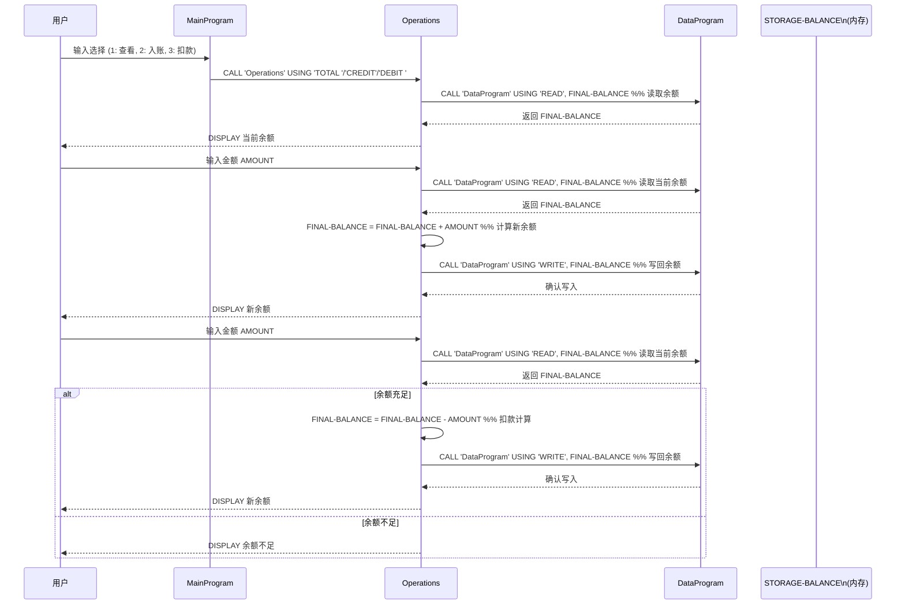

# COBOL 项目文档

本文件说明仓库中 COBOL 源文件的用途、主要子程序接口及与学生账户相关的业务规则要点。

## 文件说明

- `src/cobol/data.cob` — DataProgram
  - 目的：集中管理内存中的账户余额的读写访问。
  - 主要行为：提供一个过程，通过 LINKAGE SECTION 接收 6 字符的操作码与余额引用。调用 `'READ'` 时将内部 `STORAGE-BALANCE` 的值传回调用方的 `BALANCE`；调用 `'WRITE'` 时将传入的 `BALANCE` 值更新到 `STORAGE-BALANCE`。
  - 备注：`STORAGE-BALANCE` 在 WORKING-STORAGE 中定义并初始化为 `1000.00`。

- `src/cobol/main.cob` — MainProgram
  - 目的：顶层用户菜单与程序控制循环。
  - 主要行为：展示菜单（查看余额、入账、扣款、退出），并将用户选择映射为对 `Operations` 的调用，使用 6 字符操作码：`'TOTAL '`、`'CREDIT'`、`'DEBIT '`（以空格补足到 6 位）。
  - 输入：从终端读取 `USER-CHOICE`，当前仅做最小化校验；非法选择会显示错误提示。

- `src/cobol/operations.cob` — Operations
  - 目的：执行账户操作（查看、入账、扣款），通过调用 `DataProgram` 完成余额的读写。
  - 主要行为：
    - `'TOTAL '`：使用 `CALL 'DataProgram' USING 'READ', FINAL-BALANCE` 读取并显示当前余额。
    - `'CREDIT'`：提示输入金额，读取当前余额，加上金额后写回并显示新余额。
    - `'DEBIT '`：提示输入金额，读取当前余额，若余额充足则扣减并写回，否则显示“余额不足”。

## 主要子程序与接口

- DataProgram（`data.cob`）
  - 接口：`PROCEDURE DIVISION USING PASSED-OPERATION BALANCE`
  - `PASSED-OPERATION`：PIC X(6) — 操作码（例如 `'READ'` 或 `'WRITE'`）。
  - `BALANCE`：PIC 9(6)V99 — 以引用方式传入/传出余额数值。

- Operations（`operations.cob`）
  - 接口：`PROCEDURE DIVISION USING PASSED-OPERATION`
  - `PASSED-OPERATION`：PIC X(6) — 操作码（`'TOTAL '`、`'CREDIT'`、`'DEBIT '`）。
  - 通过 `CALL 'DataProgram' USING 'READ', FINAL-BALANCE` 与 `CALL 'DataProgram' USING 'WRITE', FINAL-BALANCE` 与存储层交互。

- MainProgram（`main.cob`）
  - 运行 `PERFORM UNTIL` 循环以提示用户并根据选择 `CALL 'Operations'`。

## 学生账户业务规则

1. 初始余额：账户初始余额由 `STORAGE-BALANCE` 或 `FINAL-BALANCE` 的初始值决定，当前为 `1000.00`。
2. 货币精度：余额与金额使用 `PIC 9(6)V99`（两位小数）。可表示的最大值为 `999999.99`。
3. 入账规则：入账操作将输入金额加到账户并通过 `WRITE` 调用持久化（当前为内存持久化）。
4. 扣款规则：仅当 `FINAL-BALANCE >= AMOUNT` 时允许扣款；否则拒绝并保持余额不变。
5. 输入校验：当前代码对用户输入的金额没有充分校验（如非数字、负数或超范围），可能导致非预期行为。
6. 操作码要求：系统使用 6 字符长度的操作码（可能包含尾随空格，如 `'TOTAL '`、`'DEBIT '`），调用方需按 PIC X(6) 要求传入正确补足的码值。

## 数据与错误情形

- 余额不足：程序会在尝试扣款时检测并提示“余额不足”。
- 溢出风险：对大额入账没有溢出检测，可能超过 `PIC 9(6)V99` 的表示范围。
- 持久化：目前 `STORAGE-BALANCE` 仅保存在 WORKING-STORAGE（内存），进程结束后数据不会保存。如需跨进程保留，需引入文件 I/O 或数据库存储。

## 建议与下一步

- 为金额输入添加校验（仅允许数字、非负、在最大值范围内）。
- 增加溢出/下溢检测并给出明确错误信息。
- 将内存存储替换为持久化存储（文件或数据库），以保证余额在重启后保留。
- 将操作码标准化为常量或查表，以避免填充错误。
- 改进用户交互流程：在金额输入不合法时重复提示而不是直接返回主菜单。

如需，我可以：
- 在各 COBOL 文件内加入内联注释说明这些规则，或
- 编写一个简单的测试工具来模拟入账/扣款并验证业务规则。

---
生成时间：2026-04-03

## 应用数据流时序图

下面的时序图展示了应用在执行“查看余额 / 入账 / 扣款”操作时，用户、主程序、操作模块与数据模块之间的数据流和调用关系。

